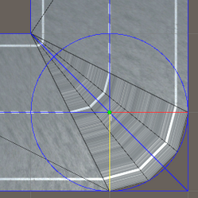

# city-from-gmlfile
## Spécifications
    Project Version : Unity 2020.3.23f1
## Données nécessaires
- Télécharger le dossier CityGML de Bron : https://download.data.grandlyon.com/files/grandlyon/imagerie/2018/maquette/BRON_2018.zip
- Copier le fichier "BRON_TIN_2018.gml" dans **Assets/gml** (le fichier, pas le dossier !)

## Chapitres
1. [Contruction des routes](#GeoRoads)
2. [Construction du terrain](#Contruction-du-terrain)
 

# GeoRoads

Par Delaunay Evann & Feuillastre Donnovan

[Rapport](https://docs.google.com/document/d/1FmAm7-7gqJv9aSPK4r23yALgCN8vLrTkClIRi87-S0E/edit?usp=sharing), [Présentation](https://docs.google.com/presentation/d/10v7n7tFI3dTT6-j4kwbwoI0YFQ5D2lqAXltg3CUg26s/edit?usp=sharing)

## Récupération de données

Nous avons dû récupérer des données GeoGML pour créer la route, étant donné que Unity ne connaît pas ce format de fichier, nous devions trouver une solution. 
Soit écrire un parseur de ce genre de données, soit trouver une librairie existante. 
Nous avons opté pour la seconde solution et modifié un peu le parseur pour permettre certains types non pris en compte ([lien parseur](https://github.com/timokorkalainen/Unity-GeoJSONObject)).

## Conversion des données

Les données étant au format GPS, nous avons dû les convertir. 
Cependant, Unity gère les nombres flottant en 32bits et les données passées sont bien plus élevées. 
Il y aura donc une perte de données obligatoire ([lien explication](https://blog.mapbox.com/wgs84-precision-in-unity-world-space-687c7d574bb3)). 
Tout comme pour la lecture des données, une librairie l'avait déjà fait dans les issues du parseur de GeoGML ([lien convertisseur](https://github.com/MichaelTaylor3D/UnityGPSConverter), [GPStoUCS](Assets/Scripts/GPSEncoder/GPSEncoder.cs#L114)).

## Création des routes

Avec des données extraites on génère les différentes routes dans unity, pour cela on génère un modèle 3D par route à l’aide d’une liste de points, chaque point contient un vecteur 2D et une hauteur afin de rendre plus simple les calculs.
Le mesh de la route est fait de segments perpendiculaires à la route connectés par deux triangles, la première étape est de trouver leur direction et longueur, dans le cas des points de départ et de fin c’est simple on calcul la normale de la route et on prend sa largeur de base. Cependant la situation se complique dans les coins car le segment doit être plus long sinon la route sera comme pincée.

    
    </img>

A gauche tous les segments ont la même longueur, à droite le segment du centre est rallongé pour éviter le pincement. Pour cela on utilise une méthode simple, on commence par calculer la tangente du coin:

    <b>
        (Direction sortie normalisé + Direction entrée normalisé) le tout normalisé
    </b>

Ensuite on prend la normale de la tangente (miter), comme on travaille en 2D il suffit de faire 

    <b>
        [-tangente.x , tangente.y]
    </b>

Et enfin pour sa longueur on divise la largeur de base de la route par le produit scalaire du miter et de la normale de la direction d’entrée.
Pour rajouter un peu plus de qualité on a aussi arrondis le coin extérieur de la route, pour cela il suffit de prendre un cercle au centre du segment avec comme diamètre la largeur de la route et de générer plusieurs points sur l’arc du cercle présent entre la normale du segment d’entrée et de sortie.

    
    </img>

 

# Contruction du terrain

Anne-Sophie Koch, Noé Ripahette, Nathan Coustance & Iwan Natij

Ce projet a pour but de récupérer un terrain texturé à partir des données CityGML de Bron disponibles sur data.grandlyon.com et de le modéliser sur Unity.

    </img>
    </img>

## Parser les données gml

Le fichier GML récupéré est composé de plusieurs parties utiles à la construction du terrain, encadrées dans des balises gml. Ces balises sont :

- gml:boundedBy : Les informations contenues donnent des informations sur la taille et la position générale du terrain. Elles serviront à centrer et à changer l’échelle du terrain ([Partie "Center et changer d'échelle"](#Mettre-en-commun--Centrer-et-changer-l-échelle)).

- core:cityObjectMember : Cette balise contient les coordonnées de chaque triangles qui composent le terrain. Le terrain est décomposé en plusieurs parcelles ([Partie "Construire les triangles"](#Construire-les-triangles)).

- app:appearanceMember : Les informations données par cette balise permettent de relier chaque parcelle du terrain à l’image qui lui correspond ([Partie "Appliquer la texture du terrain"](#Appliquer-la-texture-du-terrain)).

Pour parser ces données afin qu’elles soient utilisables dans le code, nous nous sommes servis de la classe [XDocument](https://docs.microsoft.com/fr-fr/dotnet/api/system.xml.linq.xdocument?view=net-6.0) qui construit un arbre, chaque balise devient un nœud de l’arbre, identifié par le nom de la balise.

 

## Construire les triangles

Nous avons commencé par modéliser la topographie du terrain en un seul mesh à l’aide des coordonnées fournies dans le fichier GML.

Pour cela, chaque coordonnées des triangles contenues dans les balises “gml:posList” est extraite du gml. Ces coordonnées sont sous la forme “ x1 z1 y1 x2 z2 y2 x3 z3 y3 x1 z1 y1”, les coordonnées du dernier point devant être les mêmes que ceux du dernier.

Une fois la chaîne de caractère de la balise découpée, parsée en float, puis réduite (voir 4.), ces valeurs sont utilisées pour créer les triangles du mesh, en veillant bien à l’ordre des coordonnées (dans le gml, chaque point est noté X, Z, Y), et à l’ordre des points (lors de la construction des triangles, si on ajoute le numéros des points au fur et à mesure, les normales ne sont pas dans le bon sens et le mesh est inversé. Il faut ajouter la position du premier point, puis le troisième et enfin le deuxième.)

    </img>

 

## Appliquer la texture du terrain

Le terrain est en fait composé de plusieurs tuiles, dont chaque tuile se voit attribuer une texture différente, ce dont nous nous sommes occupés dans un second temps. Le résultat final est donc constitué de plusieurs meshs, juxtaposés les uns aux autres.

    </img>

Chaque tuile est identifiée par un identifiant qui correspond à une image jpg de la ville. Chaque triangle de la tuile possède également un identifiant.
On dispose des coordonnées des uvs dans l’image (entre 0 et 1) : on peut alors décomposer l’image en plusieurs triangles, chaque triangle est associé à l’identifiant des triangles du mesh.

Une texture à partir de l’image qui correspond à la tuile est alors crée, appliqué au mesh, les uvs du mesh sont donnés dans l’ordre des triangles du mesh (ordre donnés dans l’étape précédente - 2.construire les triangles).

    </img>

## Mettre en commun : Centrer et changer l’échelle

Enfin, les données contenues dans le fichier GML sont trop grandes pour être utilisées dans l’affichage du terrain ; ainsi, il faut d’abord centrer les meshs.

Les balises lowerCorner et upperCorner donnent les coordonnées du point le plus petit et le plus grand. Ainsi, on peut calculer le point moyen, et soustraire chaque coordonnées par ce point moyen, ce qui centre les coordonnées en 0.
En hauteur en Y, le mesh n’est pas centré, et la plus petite valeur reste à 0.

Puis, pour changer l’échelle, ces coordonnées sont divisées par un nombre (nous avons pris 1000 arbitrairement).

    </img>

*Mise en commun du terrain avec le réseau routier*

La hauteur pourrait être accentué en multipliant la hauteur en Y, mais cela risquerait de décaler pour la mise en commun des différentes parties du projet global.

